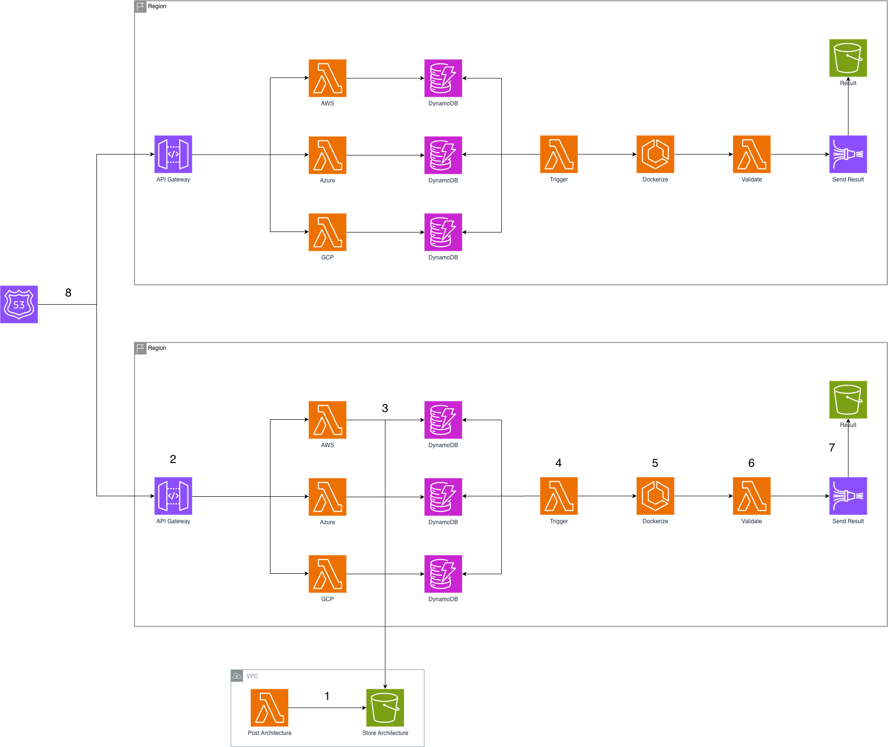

# AYGO Prototype - Daniel Sebastián Ochoa Urrego

This project is the protptype for the final project of the AYGO course. Here we created an API that translates CloudFormation templates to docker-compose specifications.

## Getting started

These instructions will help you get a copy of the project up and running on your local machine for development and testing purposes

### Prerequisites

* Git
* Java
* Maven
* Docker

If you still don't have these technologies installed, the following tutorials can help you

* Git: https://www.youtube.com/watch?v=4xqVv2lTo40
* Java: https://www.youtube.com/watch?v=BG2OSaxWX4E
* Maven: https://www.youtube.com/watch?v=1QfiyR_PWxU
* Docker: https://www.youtube.com/watch?v=ZO4KWQfUBBc

### Installing the project

To install the project on your local machine, first you'll need to clone the repository.
```bash
git clone https://github.com/DanielOchoa1214/Prototipo-AYGO.git
```

Then move into the project directory and run the following command
```bash
docker-compose up -d
```

When the command finishes running, the application should be up and running. You can verify this by checking the running containers with
```bash
docker ps
```

And if you go to http://localhost:8081//api/v1/aws and send as a body a valid CloudFormation template, you should receive a docker-compose specification as a response.

### Architecture

#### General solution

This prototype was built to test a scaled down version of the architecture proposed in the final project's article. The architecture consists of the following components:



Where: 

1. Previous step: The previous stage of the pipeline publishes to S3 the file describing the architecture required to run the component.
2. Process starts: The next stage of the pipeline sends an HTTPS request that triggers the process, indicating the cloud provider to which it belongs.
3. Normalization: Depending on the provider, a specialized normalization process will run, transforming the architecture specification into a standard model that we will store in a dedicated DynamoDB.
4. Process trigger: A Lambda function will listen for save events in the DynamoDB tables so that, when a new architecture arrives, it triggers the containerization process.
5. Dockerize: This is the core of the solution. Each time a new architecture arrives, our process will run here to transform it into a docker-compose.yml file.
6. Validation: In this step, we validate that the generated result makes sense both syntactically and semantically.
7. Result storage: Finally, we store the output in S3 so that pipeline users can access it as needed.
8. Availability: Additionally, the idea is to replicate the architecture in multiple AWS regions to guarantee the availability of the solution.

#### Prototype

For the prototype, a scaled down version of the application was developed. In this project, we implemented a solution that transforms a simple CloudFormation template into the docker-compose specification. The template is received through an HTTP request, and the body of the response returns a string containing the docker-compose content.
To use test the prototype you can use the following curl as an example:

```bash
curl --location 'localhost:8081/api/v1/aws' \
--header 'Content-Type: application/json' \
--data '{
  "AWSTemplateFormatVersion": "2010-09-09",
  "Description": "Simple CloudFormation template that creates a single EC2 instance",
  "Resources": {
    "MyEC2Instance": {
      "Type": "AWS::EC2::Instance",
      "Properties": {
        "InstanceType": "t2.micro",
        "ImageId": "ami-0c55b159cbfafe1f0",
        "Tags": [
          {
            "Key": "Name",
            "Value": "SimpleEC2Instance"
          }
        ]
      }
    }
  }
}'
```

## Version

1.0

## Author

Daniel Sebastián Ochoa Urrego - [DanielOchoa1214](https://github.com/DanielOchoa1214)

## Licence

GNU General Public License family

## Agradecimientos

* Our awesome AYGO teacher :) 
